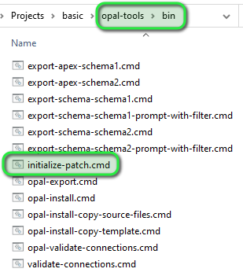
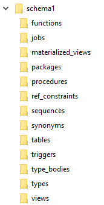

# What are the OPAL Tools?

This is a set of tools to export Oracle database objects into the file system and also to install patches into target systems (test/production). Both tools are highly flexible and driven by command-line switches. The software is written in Java and leverages SQLcl and DBMS_METADATA. The real magic happens through the generated batch scripts that leverage these command-line tools. It works nicely with Git / Subversion and supports working from the file system / from the DB or a mix of both. 

* opal-export

The exporter uses SQLcl together with DBMS_METADATA to export Oracle database objects, APEX applications, ORDS REST modules and everything as files into the filesystem. 

* opal-install

The installer uses SQLcl under the hood to actually run the SQL scripts. The core engine is very simple. It will execute SQL files which it finds by iterating through the filesystem and listing all files that exist. 

It uses regular expressions in order to figure out a mapping between a file system path and the matching connection pool. 
It can be configured in multiple ways so that there is no requirement for a specific layout of the filesystem. 

### OS support

It should work for most operating systems, it was tested on Windows, MacOS and Linux. 

# Quickstart

The binary files can be downloaded here: [https://github.com/daust/opal-installer/releases](https://github.com/daust/opal-installer/releases). This is the easiest way to use the opal-tools. The SQLcl libraries are already included in the binary distribution. 

You can also ``git clone`` this repository. In order to create the binary release yourself, please follow the instructions for [developers](src/doc/developers.md).

## Setup

Once downloaded and unzipped you run the command ``setup.sh`` or ``setup.cmd``. This will copy and customize the appropriate files. 

## Initialize a new patch

By starting the script ``opal-tools/bin/initialize-patch.cmd`` (on Windows you can just double-click it), you will be prompted for a patch name. 

The ``patch-template`` folder will be copied to the new location: ``patches/<year>/<yyyy-mm-dd-<patch name>>``. 
The new location is defined in the script ``opal-tools/bin/initialize-patch`` and can be customized to your liking. 

Next, configure the ``opal-installer.json`` file for your current patch. 
Typically, for each patch you enter the application name, the patch name and the version. If you want to make a change that is permanent for all future patches, you can even modify the patch template, then it will be picked up next time you initialize a new patch. 

## Put your files you want to install into the sql-directory

You can freely create a subdirectory structure under ``sql/<schema name>`` and put in all files you want to install. When you click on ``3.install-patch-<environment>.cmd``, those files will be executed using the embedded SQLcl engine and use the connection pools defined during setup. 

## Copy files from the source directory to the patch directory

The file ``1.copy-source-files.cmd`` is configured to copy files from the source directory ``sql`` to the target directory ``<patch name>/sql``. In the file ``SourceFilesCopy.txt`` you only configure, which files you want to have copied, e.g.: 
<pre style="overflow-x: auto; white-space: pre-wrap; white-space: -moz-pre-wrap; white-space: -pre-wrap; white-space: -o-pre-wrap; word-wrap: break-word;">
# Tables
jri_test/tables => jri_test/040_tables
<b>xlib*.sql</b>
</pre>

Only tables (i.e. files) which match the wildcard ``xlib*.sql`` will be copied to the target directory ``<patch name>/sql/jri_test/040_tables``. 

## Execute the patch

By starting the script ``3.install-<environment>.cmd|sh`` (on Windows you can just double-click it), the patch will be installed in the target environment. 

## Export database objects to the filesystem

You can export database objects into the filesystem using the scripts ``export-schema-<schema name>.cmd`` and ``export-schema-<schema name>-prompt-with-filter.cmd``

This will spool the files into the SQL source tree based on their object type. Then you can also copy them from there to the patch directory using ``1.copy-source-files.cmd`` and ``SourceFilesCopy.txt``.

# Advanced Customization

The solution can be customized to suit your needs. You can find more information [here](src/doc/Customization.md).

# Troubleshooting

Information on troubleshooting can be found [here](src/doc/Troubleshooting.md).

# Licenses

The software of this project uses the "BSD 3-Clause" license, [see here for details](https://github.com/daust/opal-tools/blob/master/LICENSE). 

Nevertheless, we are embedding software from Oracle: Oracle JDBC drivers and Oracle [SQLcl](https://www.oracle.com/de/database/technologies/appdev/sqlcl.html). 

In order to use the Oracle software, you have adhere to the [license agreement by Oracle](https://www.oracle.com/downloads/licenses/oracle-free-license.html). 
A local copy of this license agreement [can be found here](src/doc/Oracle-free-license.md). 
